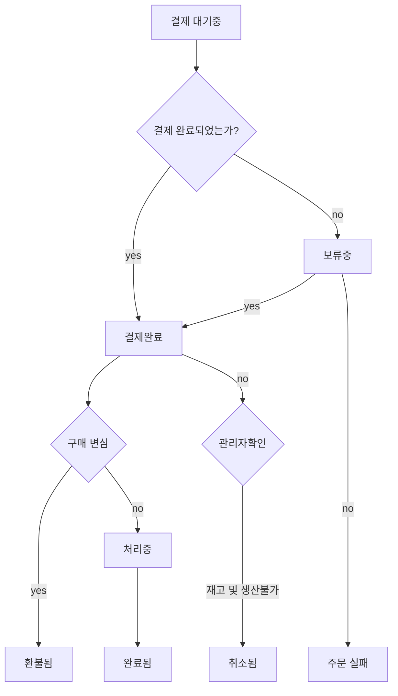

# 상태 패턴

상태 패턴은 각 객체가 특정 상태(상황) 을 나타내는 제한된 객체!?


## 사용 예시.


쇼핑몰에서 상품을 구매 시, 상품의 상태는 여러 개가 존재합니다.


### 쇼핑몰 주문 상태(Order Status)


- **결제 대기중 (Pending Payment)**

  - Order received (unpaid)

  - 주문이 접수 되었지만, 결제가 아직 이뤄지지 않은 상태입니다. 무통장 입금 등의 방법으로 주문이 이루어졌을 경우에 이상태가 됩니다.

    무통장 입금 내역을 확인하고 상태를 변경해 줍니다. 국내의 다른 쇼핑몰 솔루션은 "입금 확인중" 등으로 된  상태와 같습니다.

    

- **주문 실패 (Failed)**

  - Payment failed or was declined (unpaid). Note that this status may not show immediately and instead show as Pending until verified 

  - 결제가 실패되어 주문이 이루어지지 않았습니다. 페이팔과 같이 결제가 처리되는 시간이 필요할 경우, 이 상태는 바로 보여지지 않을 수 있고 "보류중"

    으로 보여질 수 있습니다. 신용카드 결제에 오류가 발생하거나 한도초과, 혹은 이용정지 등으로 거절된 경우입니다.

    

- **처리중 (Processing)**

  - Payment received and stock has been reduced - the order is awaiting fulfillment. All product orders require processing, except those that

    only contain products which are both Virtual and Downloadable.

  - 결제가 성공적으로 이루어졌으며, 재고 수량이 줄어든 상태입니다. 주문이 처리되고 있는 상태 입니다. 즉, 배송을 준비중이 거나, 배송이 이루어지고

    있는 경우가 이 상태에 해당 됩니다. 주문이 아직 완료 (Completed) 된 것은 아닙니다.

    

- **보류중 (On-Hold)**
  - Awaiting payment - stock is reduced, but you need to confirm payment
  - 결제가 완전히 이루어지기를 대기하고 있는 상태 입니다. 결제가 완전히 이루어졌는지 확인이 필요한 상태입니다. 재고 수량은 차감 된 상태입니다.
- **완료됨 (Completed)**
  - Order fulfilled and complete - requires no further action 
  - 주문이 완료된 상태입니다. 배송이 모두 완료되고, 고객이 물품(서비스, 가상상품 등)을 수령한 상태입니다. 이 상태 이후로는 더이상 어떤 액션이 필요하지 않습니다.
- **취소됨 (Canceled)**
  - Cancelled by an admin or the customer - no further action required ( Cancelling an order does not affect stock quantity by default)
  - 관리자 혹은 주문자(고객)에 의해 주문이 취소된 상태입니다. 이 상태라면 주문에 대해 액션이 추가로 필요하지 않는 상태 입니다. (주문을 취소하면 기본적으로 재고 수량에 변함이 없습니다.)
- **환불됨  (Refuned)**
  - Refunded by an admin - no further action required
  - 관리자에 의해 환불이 이루어진 상태입니다. 더이상 추가 액션이 필요하지 않습니다.





## 도표

**Code**

```js
class Green {
    light
    constructor(light) {
        this.light = light
    }

    go() {
        console.log('Green --> for 1 minute')
        this.light.change(new Yellow(this.light))
    }
}

class Yellow {
    light
    constructor(light) {
        this.light = light
    }

    go() {
        console.log('Yellow --> for 10 seconds')
        this.light.change(new Red(this.light))
    }
}

class Red {
    light
    constructor(light) {
        this.light = light
    }

    go() {
        console.log(`Red --> for 1 minute`)
        this.light.change(new Green(this.light))
    }
}

class TrafficLight {
    constructor() {
        this.count = 0
        this.change = (state) => {
            if (this.count++ >= 10) return
            this.currentState = state
            this.currentState.go()
        }
        this.start = () => {
            this.currentState.go()
        }
        this.currentState = new Red(this)
    }
}

const run = () => {
    let light = new TrafficLight()
    light.start()
}

run()
```
