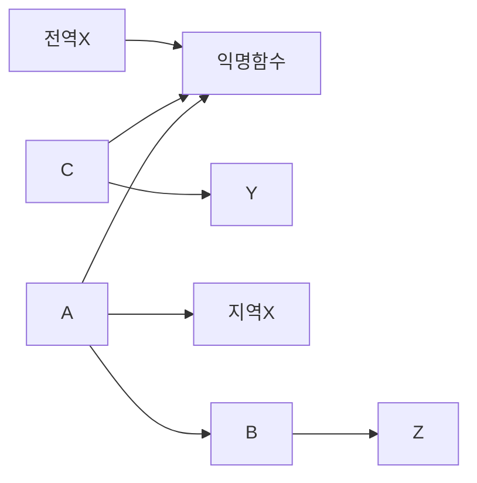

# 스코프


- 스코프
  - 블록스코프 : 블록 내에서 생성한 공간에서만 사용가능한 변수
  - 함수스코프 : 함수 내에서 생성한 공간에서만 사용가능한 변수
  - 렉시컬스코프 : 함수스코프 에서 선언 위치에 따라 사용 가능한 변수 


## 블록스코프  

### 문제 1.

```javascript
{
	var a = 10  
}
console.log(a) // 10

{
  let b = 10
}
console.log(b) // ReferenceError: a is not defined
```


### 문제 2.

```javascript
for(let i=0; i<10; i++){}
console.log(i)

for(var j=0; j<10; j++){}
console.log(j)

// 응용
for(k=0; k<10; k++){}
console.log(k) // 선언자가 없으면 var로 인식.
```


### 해설

**두가지 상황을 이해 및 말로 설명 할 수 있어야 합니다.**


사실 간단하게 설명하라고 하면 설명 할 수 있습니다.

블록스코프는 모든 `{ }` 가 스코프 역활을 하는거고,

함수스코프는 함수선언한 `{ }` 만 스코프 역활을 하는겁니다.


대표적인 예가 바로 `var` 는 함수스코프 이고

그럼 블록스코프는 `let`, `const` 가 되겠습니다. 


그러면 우리가 함수를 제외한 `{ }` 는 무엇이있나요 ?

```javascript
if() {}
for() {}
switch() {}
try{  }catch(e){ }
// 등등.. 많아요.
```


이 친구들 어떻죠?  `{}(중괄호)`는 있지만 함수로 선언된 애들은 아니죠,

그리고 이친구들은 누가 실행시켜 줍니까 ? 바로 익명함수가 실행시켜주죠,


**블록스코프, 함수스코프 예제문제**

```javascript
for (let i = 0; i < 10; i++) {}
console.log(i); // ReferenceError: i is not defined

for (var j = 0; j < 10; j++) {}
console.log(j);


/*
let j;
for (j = 0; j < 10; j++) {}
console.log(j);
*/
```


**if,for 스코프..**

```javascript
// 우리가 알고있는 if, for 문을 사용할때
// () 안에 변수 선언시 꼭 let 을 달라고 함.

for(let i=0; i<10; i++){}

// 위 와 같은 코드는 이제와서 생각해보면 사실 정확하게 해석할려면 
// 어떻게 하지? 싶습니다.
```


왜 이렇게 두개로 나누었냐면, 바로 

함수가 `값` 이기때문입니다. 결국 함수도 값이기 떄문에 함수안에서만

작동 할 수 밖에 없는 구조임.


그렇지만 블록스코프는 좀 달라요, 코드로써 영역은 나눠지지만. 

상위 스코프만 가르키게 됩니다.


상위 스코프가 무엇이냐,

```javascript
{
	var a = 10  
}
console.log(a)
// return 값이 무엇일까요 ?

// 그렇다면 var 를 let으로 바꿔볼게요.
// ReferenceError: a is not defined
```


차이를 아시겠네요? 익명함수가 실행되어서 실행컨텍스트에 변수를 담을려고

하는데, 그냥 `{}` (블록스코프) 는 실행 시키는 사람이.. 익명함수이기 떄문에..

어쩔수없이 전역으로 설정이 될 수 밖에 없습니다. 


## 렉시컬 스코프 (lexcial Scope)

`스코프` , `스코프 체인` 은 함수의 선언에 대해서 정확히 인지를 하고있어야 합니다.


```javascript
const x = 'x'
function c() {
  const y = 'y'
  console.log('c',x)
}

function a() {
  const x = 'xx'
  console.log('a',x)
  function b() {
    const z = 'z'
    console.log('b',x)
    c()
  }
  b()
}

a()
c()

// 실행순서를 맞추세요.
```




이런 것을 `렉시컬 스코프(Lexical Scope)` 라고 합니다. 


렉시컬 스코프는 선언 위치에 따라서 사용 가능한 변수를 뜻합니다.

그리고 이렇게 함수 내부를 참조 참조 해서 사용하는것을 스코프 체인이라고 합니다.

