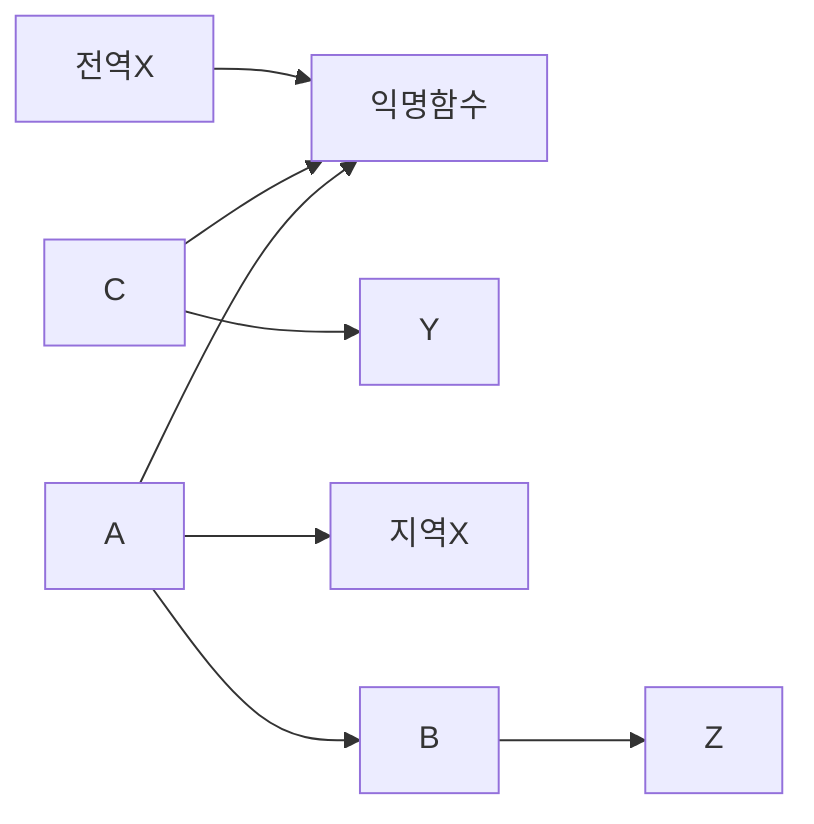

# 스코프체인

`스코프` , `스코프 체인` 은 함수의 선언에 대해서 정확히 인지를 하고있어야 합니다.


```javascript
const x = 'x'
function c() {
  const y = 'y'
  console.log('c',x)
}

function a() {
  const x = 'xx'
  console.log('a',x)
  function b() {
    const z = 'z'
    console.log('b',x)
    c()
  }
  b()
}

a()
c()

// 실행순서를 맞추세요.
```




이런 것을 `렉시컬 스코프(Lexical Scope)` 라고 합니다. 

- 함수스코프
- 블록스코프
- 렉시컬스코프


