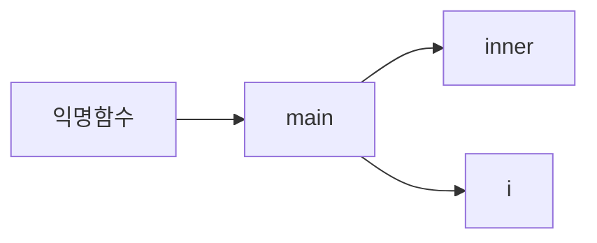
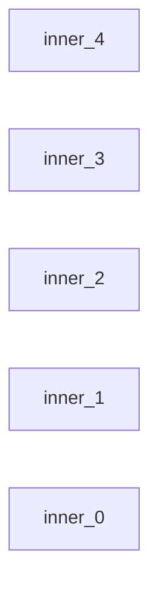

# 클로저 이해하기


**예시문제**

```javascript
function main(){
	for (var i=0; i<5; i++) {
     setTimeout(()=>{
       	console.log(i)
     },i*1000)
  }
}

main()

// 해결법 let 으로 바꾸면됨..
```


**혹은 var 상태로 문제해결**

```javascript
function main(){
  for(var i=0; i<5; i++){
    (function(j){
      setTimeout(()=>{
      	console.log(j)	
	    },i*1000)
    })(i)
  }
}

main()
```


var와 for의 비동기의 문제 

해결법 : var 유지 -> 즉시실행 함수로 클로저 생성

해결법 : var -> let 으로


## 왜 5가 나오는가!?


```javascript
function main(){
	for (var i=0; i<5; i++) {
     setTimeout(()=>{
       	console.log(i)
     },i*1000)
  }
}

main()
```


for 문안에 들어간 `i` 는  `var` 키워드는 함수스코프입니다.

그래서 `i` 라는 변수는 main 함수에 `i` 값을 저장합니다.


이후 main함수가 호출이되면,

for문이 5번 반복합니다. 


그리고 main 함수에 선언된 i를 5씩 증가시키고,

백그라운드에 콜백함수를 5개를 등록하고 매초마다,


콜스택에 호출하여 함수를 실행하죠, 그때 i는 main 함수 내부에서 

접근 되기 때문에 i가 이미 5가 된 이후에 실행되다보니,

이러한 현상이 발생됩니다,


클로저가 이해하기 위해서 이코드를 이해해야하고,

이코드는 실행컨텍스트, 스코프, 이벤트루프 에 대해서 이해를 하고있어야지

배움이 가능한 영역입니다. 


그래서 스코프영역을 let으로 바꿔서 블록스코프로 영역을 바꿔서 실행하면

된다는 것을 이해하고 있어야합니다.


## 그러면 즉시함수는 왜 되는가? 


```javascript
function main(){
  for(var i=0; i<5; i++){
    (function(j){
      setTimeout(()=>{
      	console.log(j)	
	    },i*1000)
    })(i)
  }
}

main()
```


일단 var를 쓰면 main 함수에 선언된것처럼 되는것을 알고있는 것을

가정하고 시작해야합니다. 


위에 있는 코드를 이해를 돕기 위해 수정해서 설명하도록 하겠습니다.


```javascript
function main() {
  function inner(k) {
    setTimeout(() => {
      console.log(k);
    }, k * 1000);
  }

  for (var i = 0; i < 5; i++) {
    inner(i);
  }
}

main();
```


위에 코드는 그전 코드와 같은 내용입니다 살짝 더 분해해서 설명해드립니다.


`main` 함수가 호출되면서,  main 함수 안에 inner 함수를 선언하여

스코프 체인은


이런 형태로 사용됩니다.

하지만 

for 문 안에 i 는 함수스코프이고, 사용하는 공간은 블록스코프이기 떄문에,

선언 자체가 for문 안에서만 사용가능하는게 아닌 main 으로 잡히기됩니다.





그리고 메인 함수가 호출되었으니 반복문이 실행되죠,

```javascript
for (var i = 0; i < 5; i++) {
	inner(i);
}
```


이때 호출스택에서 inner(i) 가 5번 호출됩니다.




즉 이친구들을 5번 코드를 실행시키면 되는 상황인데

인자값으로 0~4 까지 넣은 상황이죠,

```javascript
// inner 함수 내부.
setTimeout(() => {
  console.log(k);
}, k * 1000);
```


Inner_0 이 실행되는 상황에서는 k 값이 0 ...

0~4까지 같은 순으로 시작합니다.


즉 `setTimeout` 의 콜백함수는 콜스택에 들어가면서 

k 라는 변수를  찾을때, 스코프체인으로 k 변수를 찾습니다.

k는 inner 함수를 실행한 콜스택에서 사용하게 되죠.


함수와 외부 변수의 관계를 정확하게 알기만 하면 너무나 쉽습니다.

즉 선언 기준으로 변수를 어디까지 쓸 수 있는지 찾아가면 됩니다.


클로저는 엄청 대단한 것이 아니라 선언 기준으로 변수만 잘찾으면 됩니다.

그냥 스코프 개념 정확하게 이해만 하면,, 오히려 배울 필요가없는 개념이에요


**응용문제..**

```javascript
function inner(){
  let count = 0
  function outer(){
    count++
    return count
  }
  
  return outer
}

const counter = inner()

counter()
counter()
counter()
const a = counter()
console.log(a)

// console.log(count)...
```


**응용문제 2.**

```javascript
function Counter(type){
  let count = 0
	function increment(){
    count++
    return count
  }
  function decrement(){
    count--
    return count
  }
  
  return type === 'increment' ? increment : decrement
}

const increment = Counter('increment')
const decrement = Counter()

increment()
increment()
decrement()
const result = increment()
console.log(result) // why 3 
```

