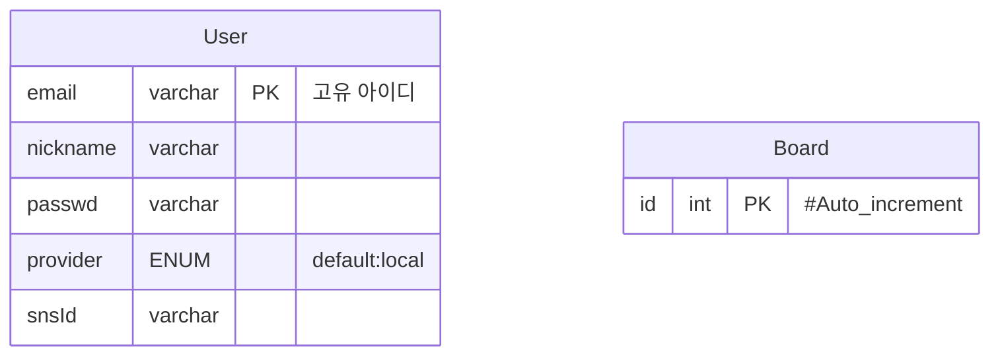

# 테이블 스키마



```mermaid
erDiagram

User {
	email varchar PK "고유 아이디"
	nickname varchar
	passwd varchar 
	provider ENUM "default:local"
	snsId varchar
}

Board {
	id int PK "#Auto_increment"
}
```

# Setting

> **참고** - https://velog.io/@jujube0/Sequelize-%EB%AC%B8%EC%A0%9C%ED%95%B4%EA%B2%B0

```
npm install -D dotenv jest node-mocks-http supertest
```

