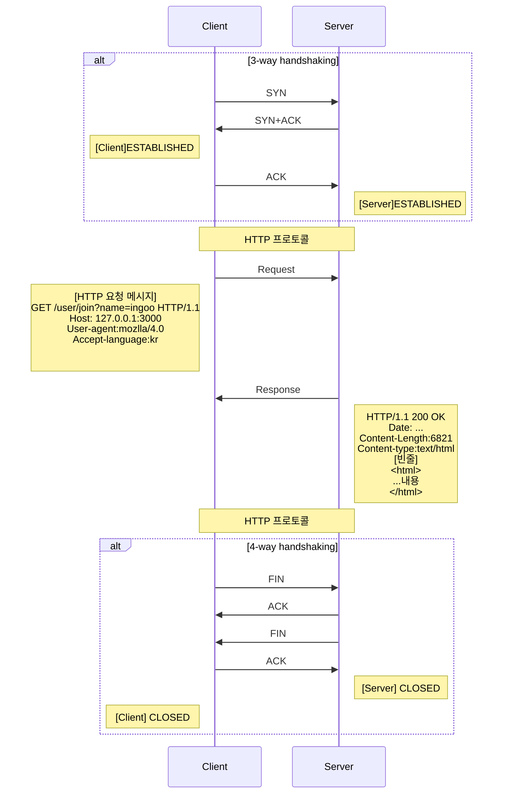

# HTTP 프로토콜 이해


> **Hypertext Transfer Protocol**
>
> HTTP는 서버와 클라이언트가 데이터를 주고 받기 위한 프로토콜


- HTTP 는 어떤 종류의 데이터도 전송할 수 있도록 설계되어 있음 (동영상, 오디오, 텍스트문서 등)
- HTTP는 계속 발전하는중 HTTP/2 까지 버전이 있고, 가장많이 쓰는 버전은 HTTP/1.1


## HTTP 특징


- HTTP 는 연결 상태를 유지하지 않는 비연결성 (Stateless) 즉 연결 후 서로간 데이터를 필요한만큼 주고받으면 연결을 끊는다는 이야기

  연결이 끊기고 나면 서버입장에서 클라이언트의 이전 상황을 알 수 없음 (로그인 같은 기능을 구현하기 어려움)

- HTTP 기본골격은 요청이있으면 무저건 응답을 주는 형태 


## HTTP 동작방식


브라우저에서 `URI`   입력시 동작 형태





### HTTP 요청 메시지


```
GET /user/join?name=ingoo HTTP/1.1
Host: 127.0.0.1:3000
User-agent:mozlla/4.0
Accept-language:kr


```


일단 요청, 응답 메시지는 크게 2가지 형태로 읽어야 합니다.

`Header` 와 `Body` 로 구분하여 읽어야합니다.


그리고 `Header` 에서 첫번째 라인을 `start line` 이라고 말합니다.

이후 빈줄 다음 내용을 `body` 영역이라고 합니다. 

기본적으로 요청메시지는 `body`  내용이 없을수도 있고, 있을수도 있습니다.


**Start Line**

```
GET /user/join?name=ingoo HTTP/1.1
[요청메서드] [요청URI] [HTTP 프로토콜 버전]
```

띄어쓰기로 구분해서 읽어야합니다.


- 요청메서드 (Request Method)
  - GET : 데이터 요청 의미로 사용
  - POST : 데이터 입력의 의미로 사용
  - PUT : 데이터 수정에 의미로 사용
  - DELETE : 정보를 삭제하기 위해서 사용
  - HEAD : (HTTP) 헤더 정보만 요청 해당 자원이 존재하는지 혹은 서버에 문제가 없는지 확인 용도
  - OPTIONS : 웹서버가 지원하는 메서드의 종류를 요청
  - TRACE : 클라이언트의 요청을 그대로 반환

- 요청 PATH
  - host를 제외한 나머지 URI 를 적어놓은다. 
- 프로토콜 버전 : HTTP 는 버전이 1.0 1.1 2.0 이있는데 보통 1.1을 많이 사용한다.


**header**

header 내용을 상세하게 파악할려면 책한권이나온다.

많이 사용해야하는

`Content-Type` 정도만 알아두어도 충분하다.


**body**

요청 데이터를 넣는공간이다. 

예전에 HTML에서 form 엘리먼트를 만들어서 method="post" 넣은거 기억하는가?

그때 보여줬던 데이터들이다.


### HTTP 응답 메시지

```sh
HTTP/1.1 200 OK
Date: ...
Content-Length:6821
Content-type:text/html
[빈줄]
<html>
...내용
</html>
```


응답 메시지도 마찬가지로 

- Header
- Body


영역으로 읽으며, Header 중에 첫번째 줄을 `start line` 이라고 읽는다.


**start line**


- 프로토콜 버전
- 상태코드
- 상태메시지 


