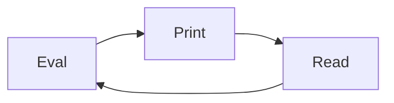

# NodeJs


## 1. repl 사용하기


REPL(레프) 는

- R (read)
- E (Evaluate) 
- P (Print)
- L (Loop)

의 약자입니다.


`Javasceript` 는 스크립트 언어라서 즉석에서 코드를 실행할수 있습니다 (반대는 컴파일언어)



이러한 형태로 반복적으로 실행됩니다.


들어가는 방법은

터미널에서

```js
$ node
```

만 치시면 `레프` 모드로 들어가게 됩니다.


단순한 코드를 작성해보도록 하겠습니다.

```javascript
const str = 'hello world'
```

이 한줄의 실행을 `str` 이라는 메모리 공간을 만들고 `hello world` 라는 문자열을 저장하는 코드를

`읽고 (read)`

이후 내용을 `평가(evaluate)` 이후

`출력(print)` 합니다.


이번엔 `console.log` 를 써서 작업해보겠습니다.

```javascript
console.log(str)
// hello world!
// undefiend
```


레프를 종료하실려면 `ctrl + c` 로 나가시면 됩니다.


## 2. Javascript 파일로 실행하기


작업디렉토리를 생성하고 `visual studio code`  를 켜봅시다.

> 제 디렉토리는 ~/workspace/nodejs
>
>  cd ~/workspace/nodejs


chapter1.js 파일을 생성하고 다음과같이 코드를 작성합시다.


**chapter1.js**

```javascript
const ingoo = () => {
	ingoo2()
	console.log(`hello world!`)
}

const ingoo2 = () => {
  console.log(`hello world2`)
}

ingoo()
```


이전에는 `브라우저에서 코드를 실행줬다면 지금은 nodejs 라는 Javascript runtime` 으로 실행합니다.

그렇다면 우리는 nodejs 를 실행하는 방법을 알아봐야 합니다. 간단합니다.


```sh
# node 파일경로/파일명
$ node cahpter1.js
```


## 3. 모듈 만들기 


우리는 github을 배우면서, 배운 한가지가 있습니다.

한파일에 기능을 여러개를 때려박으면 어떨까요 ?


협업하기가 엄청어렵겠죠, 

파일은 규칙에 맞게 나눌수있으면 나누는것이 좋습니다.


우리가 사용하는 `모듈` 이라는 뜻은, 우리가 구현할려는 하나의 큰 프로그램에서

작은 단위라는 뜻으로 이해하면 조금 더 편할거같습니다.


그럼 우리는 작은 모듈을 만들어봅시다.


**data.js**

```js
const list = [
	{
		index:0,
    subject:'아반떼',
    date:'2022-01-25',
    hit:0
	}
]
```


**view.js**

````javascript
console.log(list)
````


이렇게 작업을 한다음에 

```javascript
$ node view.js
```


실행을하면 작동이안되죠, 내용을 가져 올 수 있습니다.

방법은 **module.exports** 를 통해 해당 파일의 결과물을 보낼수있게됩니다.


*view.js* 는 *list.js* 에 가지고있는 data 라는 변수가 필요합니다.


**data.js**

```javascript
const list = [
	{
		index:0,
    subject:'아반떼',
    date:'2022-01-25',
    hit:0
	}
]

module.exports = data
```


**view.js**

```javascript
const data = require('./data.js') // .js 는 생략이 가능합니다.
console.log(data)
```


이런 형태로 require 를 해서 내용을 가져올수 있게 됩니다.

list.js 에서 있는 module.exports 는 

만약 list.js를 require 를통해 가져올경우 리턴값이 됩니다.


