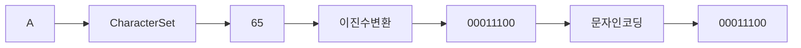
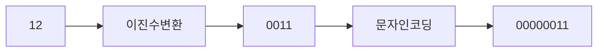

# Buffer


Nodejs 내장객체


## Buffer 란 ? 


**nodejs 공식문서 발췌**

> 바이너리 데이터들의 스트림을 읽거나, 조작하는 매커니즘
> 이 Buffer class는 Nodejs의 일부로 도입되어 TCP 스크림이나 File 시스템같은
> 작업에서의 octet스트림과의 상호작용을 가능하기위해 만들어졌습니다.
>
> *[octet Stream은 일반적으로 8bit 형식으로 된 데이터를 의미합니다.]*


조금더 내용을 정리하자면.

**Buffer Class 는 Binary Data들의 Stream을 직접 다루기 위해 NodeJS API에 추가되었습니다.**


### 1. Binary Data


컴퓨터는 기본적으로 0, 1 으로만 데이터를 표현합니다.

그리고 우리는 데이터를 표현할때 `bit` 혹은 `byte` 라는 단위를 많이 사용하는데.

데이터의 가짓수를. 표현할때 사용하는 방법이라 보시면 될거같습니다.


우리는 `12` 라는 숫자를 저장할때 12를 쓰면 되겠지만 2를 모르는 컴퓨터는 절대 12라는 값을 저장하지 않습니다.

아마 2진수로 `1100` 으로 저장하겠죠 ?


숫자는 데이터를 표현할때 변환이 그나마 쉽습니다. 하지만 글자는 어떨까요 ?

혹시 `A` 라는 글자를 이진수로도 표현이 가능할까요? -> `네 가능합니다`


**실행 시켜보세요.**

```javascript
`A`.charCodeAt(0)
// A : 65
// a : 97
```


컴퓨터는 `A` 와 `a` 라는 글자를 각자 다르게 인식합니다. 그리고 보시는것과 같이 숫자로 표현합니다.

이런걸  **Character Code** 라고 합니다.

그런데 어떻게 컴퓨터는 A라는 것을보고 65, a 라는 것을 보고 97 이라는 값을 아는걸까요?

그건 사람이 미리 A->65, a->97 이라고 미리 정의 했기 떄문입니다.

이런걸 **Character Set** 문자 집합이라고 합니다.


#### 1-1. Character set (문자집합)

*Character Set* 은 각각 문자를 숫자 표현 할 수 있도록 정의한 규칙

A를 65로, a를 97로 매칭 되도록 하나의 글자마다 숫자로 정의 함


그리고 이러한 문자집합은 또 종류가 몇가지 더있습니다. 

바로 대표적으로 `유니코드` 와 `아스키코드` 가 존재하겠네요.

> 지금 Javascript 에서 사용하는것은 유니코드입니다.


#### 1-2. ASCII CODE (아스키코드)

이에 대해 짧게 설명하자면 `ASCII CODE`  글자를 표현할때 `8bit` 만 사용합니다.

즉 `1 byte` 만 사용하죠. 

> 8bit 중 한자리는 오류체크용도로 사용합니다 실제로 사용하는 7bit 입니다.


0000000~1111111 즉 `2^7` = 128 입니다. 아스키코드는 128 가지의 글자만 표현이 가능합니다.

한글을 제외하고 키보드 자판에있는 정도의 표현만 가능한 수준이죠 (영어와 단순한 특수문자만 된다는뜻!) 


그래서 한글은 1 byte 만으로 표현이 안되기 떄문에 알파벳 1글자와 한글 1글자와 크기가 다르다는거

알고계셨나요 ?


```javascript
a
ㅁ
```


네 한글과 같이 다른 문자를 표현하기위해서 새로 나온것이 바로 `유니코드` 입니다.

한글이 된다면 일단 유니코드다 라고 알고계시면됩니다.


#### 1-3. Unicode (유니코드)


유니코드는 전 세계의 문자를 일관되게 표현할 수 있도록 설계된 표준이다. 

아스키코드와 유니코드의 큰차이점은 용량의 차이겠습니다.


글자하나당 1byte가 아닌 2byte 를 사용한다는 점입니다. 

그리고 기존의 아스키코드는 그대로 사용하고있습니다.


더이상 들어가면 머리가 아프기 떄문에 이정도만 알면 좋겠습니다 문자셋 은 이정도만 알고있냐 모르냐 차이가 큽니다.


#### 1-4. Character Encoding (문자 인코딩)


문자를 숫자로 나타내는 것에 규칙이 있는것 처럼

숫자를 바이너리 데이터로 나타내는 데에도 규칙이 존재합니다.

`유니코드` 기준으로 설명을하자면 숫자  `A` 는 `65` 를 뜻합니다. 

이숫자를 2진수로 표현하면 `1000001` 가 됩니다.  8bit로 표현이 가능하죠

하지만 숫자를 표현할때 다소 문제가 발생합니다.

`12` 라는 숫자를 2진수로 표현할때는 `1100` 로 표현합니다. 

갑자기 `4bit` 가 되어버려요. 이게 왜 문제냐면 

A12 라는 글자를 적으면 컴퓨터는 2진수로 `100000011100`  라는 갑을 반환하겠죠 ?

보이세요..? 이거 다시 글자로 바꿔야 할 상황에 컴퓨터가 도대체 어디서부터 몇글자를 짤라야할지..

모릅니다

예를들어 앞에 4글자와 뒤에 8글자를 짜른다고 치면

`1000` `00011100` 으로 컴퓨터가 해석을하면 아예 다른 결과물이 나옵니다. 정확하게

앞에 8bit 와 뒤에 4bit로 짤라야지만 다시 A12 라는 글자를 만들수가 있어요 

그래서 나온것이 바로 **Character Encoding(문자 인코딩)** 입니다. 

문자인코딩 도 다양한 방법이있는데 그중하나인 `UTF-8` 을 다뤄보자면 8의 숫자가 바로 bit를 뜻합니다.

8bit 즉 1byte를 말하는거죠 


하지만 12 라는 숫자는 4bit 로 표현이 가능하지만 문자인코딩을 통해서 8bit로 변환해야합니다.

변환한다고해서 어렵게 생각하지마세요 단순하게 4자리 숫자를 8자리 숫자로 표현할뿐이니깐요..

`0000` + `1100` 으로 표현하는겁니다 그냥 자리수만채우는거에요. 그래서 12 라는 숫자는 

문자인코딩을 통해서 `00001100` 으로 표현됩니다.


> 인코딩의 반대말은 디코딩입니다.


#### 1-5. 정리

**글자 A**




**숫자 12**




### 2. Stream 


Nodejs 에서 스트림은 간단하게 한 지점에서 다른 지점으로 이동하는 일련의 데이터를 의미합니다.

이를 통해, 방대한 데이터 처리 할때 모든 데이터가 전부다 사용가능 할때까지 기다리지 않아도 됩니다.


기본적으로 큰 데이터는 `청크단위` 로 세분화되어 전송됩니다. 이말은, 처음 설명했던 Buffer의 정의를 따르면

파일 시스템에서 바이너리 데이터들이 이동한다는걸 의미합니다. 

예를들어

file.txt -> file2.txt로 옮기는 걸 의미합니다.


하지만 Streaming 하는 동안 Buffer 라는 것이 어떻게 바이너리 데이터를 다룰 수 있게 도와준다는 것일까요?

Buffer는 무엇일까요 ?


### 3. Buffer

우리는 데이터들의 스트림이란 일련의 데이터들이 한지점에서 다른 지점으로 이동하는 것이라는 걸 배웠습니다.

하지만, 데이터들이 정확하게 어떻게 이동한다는 것일까요?

일반적으로 데이터의 이동은 그 데이터를 가지고 작업하거나, 그 데이터를 읽거나, 무언가를 하기위해 일어납니다.

하지만 한 작업이 특정시간동안 데이터를 받을 수 있는 데이터의 최소량 과 최대량이 존재합니다. 그래서 만약에 

한 작업이 데이터를 처리하는 시간보다 데이터가 도착하는게 더 빠르다면, 초과된 데이터는 어디에선가 처리되기를 기다리고 있어야 합니다. 데이터를 처리하는 시간보다 훨씬 빠르게 계속해서 새로운 데이터가 도착하면 어딘가에는 도착한 

데이터들이 미친듯이 쌓일것이기 떄문이죠.


반면에, 한 직업이 데이터를 처리하는 시간이 데이터가 도착하는 시간보다 더 빠르다면, 먼저

도착한 데이터는 처리되기 전에 어느정도의 데이터량이 쌓일때까지 기다려야 합니다.


바로 그 기다리는 영역이 Buffer 입니다 ! 컴퓨터에서 일반적으로 RAM 이라고 불리는 영역에서

streaming 중에 데이터가 일시적으로 모이고, 기다리며 결국에는 데이터가 처리되기 위해

내보내어 집니다.


Streaming과 Buffer의 과정을 버스정류장에 빗대어 설명할수 있습니다. 어떤 버스 정류장에서는,

어느정도 이상의 승객이 모이지 않거나, 출발시간 전에는 출발하지 않습니다.

그리고, 승객들은 버스정류장에 도착하는 속도도 도착하는 시간도 각각 다릅니다. 승객 자기자신도 버도

그 어느 누구도 버스정류장에 승객이 도착하는걸 마음대로 제어할 수 없습니다.

(승객이 버스정류장에 도착하는 것도 결국에는 승객 스스로 제어하는게 아니라 환경적 요인에 달렸다는 말입니다.)


어쨋든 일찍 도착한 승객은 버스가 출발하기 전까지는 버스정류장에서 기다려야 합니다.

반대로 승객이 도착했을때, 버스가 이미 문을 닫고 출발하기 직전상태이거나 버스가 이미 출발한

상황일때는 다음 버스를 기다려야 합니다.


어떤 경우든지, 승객이 기다리는 위치가 있습니다. 바로 버스정류장 입니다. 바로 그게 

Nodejs에서 Buffer 입니다. Nodejs는 데이터가 도착하는 시간이나 전송되는 속도를 제어 할 수 없습니다.

Nodejs가 결정할 수 있는건 언제 데이터를 내보내느냐 입니다. 버스를 언제 출발시킬수 있는

제어권이 있는 것과 동일합니다. 아직 데이터를 내보낼 떄가 아니면, Nodejs는 데이터들을 일종의 대기영역인

RAM에 작은영역인 Buffer에 데이터를 넣어놓습니다.


일상생활에서 버퍼작동을 볼 수 있는 예로 온라인 영상을 시청할때 입니다. 유튜브 보는 순간을 상상해보세요.

우리가 인터넷 연결 상태가 매우 좋을때에는 영상 스트리밍과 끝날때 까지

버퍼를 채우고 데이터가 처리될 수 있게 빠르게 내보내고, 다시 버퍼를 채우고 빠르게 내보내고 를 반복합니다.


그러나 인터넷 연결상태가 좋지 못할 때에는 첫번째 데이터셋을 처리하고 나서, 영상플레이어는 

로딩 아이콘을 띠우면서 `Buffering` 이라는 텍스트를 보여줄겁니다. 이것은 데이터가 더 모이고 

도착할때까지 기다린다는 의미입니다. 만약 버퍼가 채워지고 데이터가 처리되면, 영상이 다시 보여지게 될 것입니다.

영상을 보여주는 동안에도, 계속해서 다음 데이터가 도착하고, 버퍼에 채워질 것입니다.


이것이 바로 버퍼입니다.


아까 보았듯이 버퍼에 대한 설명에서, 데이터가 버퍼에 있는 동안 우리가 `Streaming` 되는 바이너리 데이터들을

조작하고 다룰 수 있다고 했습니다. 우리가 이런 raw한 바이너리 데이터들을 이용해서 어떤 종류의 작업을 할 수 있을까요?

`Node.js` 에서 구현한 Buffer 문서에는 우리가 다룰 수 있는 작업 내용들을 리스트로 정리해서 보여줍니다.

그중 몇가지를 살펴봅시다.


### 4. 실습 

우리는 직접 Buffer를 만들 수도 있습니다. Nodejs는 Streaming 하는 동안 자동으로 Bufferf를 만드는데요, 

이것말고도 우리가 직접 Buffer를 만들고 직접 다룰수 있습니다. 흥미롭죠? 한번 저희가 직접 만들어 봅시다.


버퍼를 만드는데에는 여러가지 방법이있습니다.

```javascript
const buf1 = Buffer.alloc(10) // Size가 10인 버퍼를 만듭니다 (10 Byte)
const buf2 = Buffer.from("Hello Buffer") // Buffer에 `Hello Buffer` 라는 데이터를 담습니다.

// 버퍼 내용을 확인해봅시다.

console.log( buf1.toJSON() )
console.log( buf2.toJSON() )
console.log(buf1.length)
console.log(buf2.length)

// 빈공간 버퍼에 내용넣기
buf1.write("Buffer really rocks")

// 버퍼를 Decoding 합니다.
console.log( buf1.toString() )
```


**문제.1**

abcd 라는 문자가있다 각각 한글자씩 올려보기
bcde

```js
```


