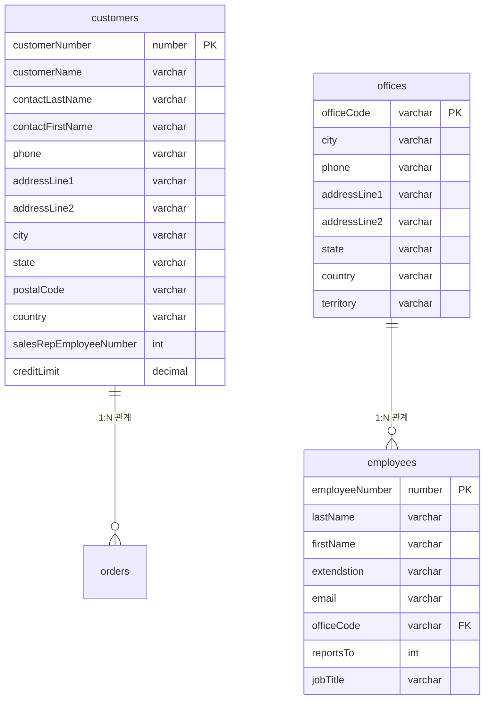

# Select 문 파훼치기

> **연습사이트**
>
> https://www.w3schools.com/sql/trysql.asp?filename=trysql_select_all
>
> **참고자료** 
>
> http://bigdata.dongguk.ac.kr/lectures/DB/_book/MySQL1.html#%ED%85%8C%EC%9D%B4%EB%B8%94%EB%A1%9C%EB%B6%80%ED%84%B0-%EC%9E%90%EB%A3%8C-%EA%B2%80%EC%83%89


**예시 테이블**

```sql
mysql -uroot -proot
mysql > create database classicmodels
mysql > exit

mysql -uroot -proot classicmodels < mysqlsampledatabase.sql
mysql: [Warning] Using a password on the command line interface can be insecure.

mysql -uroot -proot 
use classicmodels

mysql> show tabels;
```


> 나중에 ERD 그려보자...




```
CUSTOMER ||--o{ ORDER : places
    CUSTOMER {
        string name
        string custNumber
        string sector
    }
    ORDER ||--|{ LINE-ITEM : contains
    ORDER {
        int orderNumber
        string deliveryAddress
    }
    LINE-ITEM {
        string productCode
        int quantity
        float pricePerUnit
    }
```


## 1. 비상관 서브쿼리

```sql
SELECT * FROM orderdetails; -- 주문 상세
SELECT * FROM orders; -- 주문
SELECT * FROM productlines; -- 상품라인
SELECT * FROM employees; -- 직원
SELECT * FROM offices;
SELECT * FROM customers; -- 고객
SELECT * FROM payments; -- 결제
SELECT * FROM products; -- 상품


```
