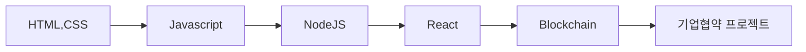

# 경일게임아카데미 - 블록체인 스크립트

#  블록체인 

( 약 10 개월 193일  27 주  ) 커리큘럼

**커리큘럼**

Javascript 를 하는 이유 

블록체인이라는 것은 백앤드의 심화 과정이라고 생각해도 편합니다.

그래서 Javascript는  front-end 개발에서는 필수적인 언어이지만,

Back-end 에서는 다른 언어로도 가능합니다. 

하지만 저희는 Front-end, Back-end 를 배워야 하기 때문에 하나의 언어로 두가지 개념을 배울수 있도록

NodeJS를 활용해 웹서버 구현을 진행합니다.

또한, Blockchain 배우기 위해 이론 개념을 배워야 하는데, 이론 수업으로 블록체인을 배우는것이 아닌,

Bitcoin 기술 스택을 Javascript로 구현 함으로써, BlockChain 에서 Block 이 어떻게 생겼는지,

Chain 이 무엇인지, 그리고 작업증명이 왜 필요한지를 구현함으로써 이론을 학습합니다. 

**어떤 형태로 수업을 진행하는지**

1. 44 수업 진행 

44 수업이란 4시간 수업 4시간 실습 시간을 말합니다.

이 수업모델의 장점은 바로 학습 내용을 소화할 시간이 필요하다는 건데요,

지식을 알려주고 공유하는 것은 저의 역활이겠지만. 학생들은 그내용은 훈련과 반복을 통해 습득해야만 합니다.

많이 드는 예시로, 아무리 야구선수라고 할지라도, 커브볼을 던지는 그립을 알려준다고, 바로 커브를 못던지듯이,

우리는 커브를 던지는 그립을 알려주고, 커브를 던지는 연습 방법을 알려주고, 어디까지 되었고, 어디가 부족한지 시간을 

할애하고, 연습 할 수 있도록 유도 합니다.

이런게 바로 `자기주도학습` 이 아닐까요 ? 

2. 오프라인

KGA 블록체인 과정은 타사 다른 블록체인 과정과 다른점은 바로.

**많은 교육시간 ( 36 주)** 과 **오프라인 수업** 입니다.  

학생 분들에게는 이 기간이 너무 길게 느껴지실수도 있겠는데요, 

여러분들이 많이 놓치시는 지표가 있습니다, 바로 **수료이후 취업기간** (지표데이터가 필요합니다.)

저희 KGA 블록체인 과정은 수료이후 1달 이내에 취업이 거의 완료가 됩니다.

이 뜻은 과정 기간내에 내용을 이수만 한다면 바로 취업 할 수 있는 수준이 된다는 뜻입니다. 

아무리 기간이 짧게 배운다 한들, 내가 취업 할 수 없는 상태라면, 개인적으로 더 공부하잖아요? 

우리는 그런 기간이 없습니다. 수료만하면 바로 취업이 가능합니다! 

또한 이것이 가능한 이유는 바로 **오프라인** 이라는 점 때문입니다.

물론 온라인 수업이 시간적 활용이 효율적일수 있겠으나, 우리는 직접 대면하고, 

이야기를하며 표정으로 학생들이 이해했는가 못했는가를 `실시간` 체크하여, 설명을 부가적으로 하거나,

직접가서 물어보기 합니다. 단순 설명으로는 `Youtube` 나 `Online` 강의로도 충분합니다.

하지만 KGA 블록체인 과정은 학생들과 직접 대면하여 수업하기 떄문에 여러분들의 상황에 맞게 추가설명도 가능합니다!

3. 프로젝트  

대부분 교강사가 써준 코드를 그대로 배껴서, 프로젝트를 진행하거나, 포트폴리오를 진행합니다.

하지만 KGA 블록체인 과정은 그렇지 않습니다. 

기초, 이론과 개념을 확실히 학습과 훈련을 시키고 이후에 학생이 원하는 내용을 `직접 구현` 합니다.
그래서 다양한 포트폴리오가 나오게 되고, 신입으로 취업 경쟁에 큰 힘이 됩니다.

온라인 강의에 있는 지루한 클론 코딩의 포트폴리오가 아닌, 본인의 아이디어를 직접 구현하는 프로젝트가 될것입니다.

**마지막에 어떤 결과물을 도출하는지 **

마지막에 기업협약 프로젝트로 마무리가 되어, 블록체인 내용으로 결과물을 만들어 지며, 그를 토대로 

프로필문서, 포트폴리오가 완성됩니다. 그리고 협약프로젝트에서 마지막에 발표회를 진행하는데. 

다양한 회사에서 참관하게됩니다. 실제로 여기서 바로 취업과 연결되거나, 1차패스 하고 면접까지 보는 경우도 생깁니다.

즉 이미 기술로 검증받은 상태로 면접에 임하게 됩니다. 높은 확률로 취업할수 있겠죠 ?

**Q&A**

**수업 시작 하기전에 미리 준비해야할게 있나요 ? **

Javascript 문법 공부를 하시면 너무 좋습니다. 

**취업률 이 어떻게 되나요 ?**

기수별 취업률 기재. 수료후 취업기간 

**평균연봉이 어떻게 되나요 ?**

**최저연봉은 2800**

평균연봉은 3400~3600

최대연봉 4000

**프론트 앤드, 백 앤드, 블록체인 어디로 취업하나요 ?**

사실 과정이 프론트앤드와 백앤드, 그리고 블록체인 까지 배우다보니,

사실 블록체인만 취업하는 경우가 있지는 않습니다. 

블록체인 자체가 나름 난이도가 있는 기술이다보니,

Front-end , Back-end 를 어느정도 잘 다뤄야지만 블록체인을 배울수있어요,

그러다보니 학생들이 가끔 ` 풀스택 ` 과정이냐 오해하는 학생들도 있더라구요, 

풀스택 과정은 아니지만 풀스택을 해야하는 현실이기에 

원하는 스택으로 취업도 가능합니다.

**비전공자도 배울수 있나요 ? **

네 물론 배울 수 있습니다. 

비전공자가 코딩을 배울때 가장 어려운 점은, 용어 정리 및 사고 전환이 필요합니다.

본인이 필요한 지점을 확실하게 인지하고, 훈련하게 된다면, 

본인이 원하는 것을 구현할수 있게 됩니다.

 

