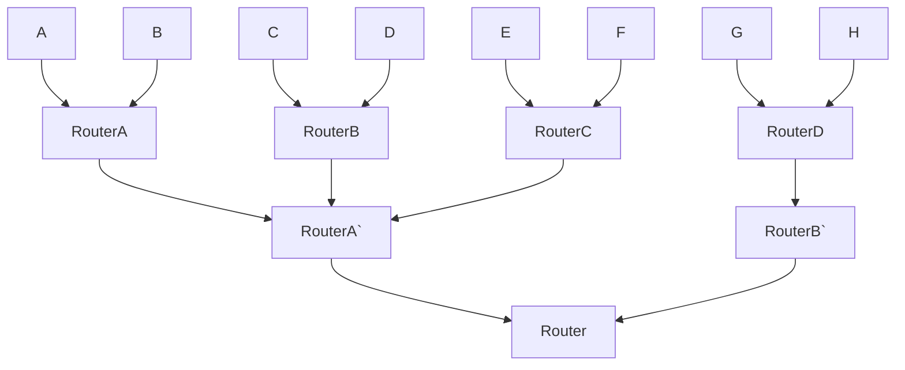

# Switch 가 하는일 

네트워크를 비유할때 가장 좋은 예제는 바로 고속도로 입니다.

이 고속도로 망이라고 부르기도합니다.

도로망이라고 하잖아여?

고속도로라고하고 네트워크하고 엄청 많이 닮아있습니다.

운전을 하시는분들이라면 좀더 이해하기 편할거 같습니다.

처음 출발지가 있다면 차량으 운전을한다면 도착지까지 갈텐데.

우리가 출발지에서 도착지점까지 갈 방법이 너무나도 많잖아요 ?

그리고 그것은 대부분 교차로 라는 것을 만나서 어디로가든 결국 갈수있는 방법이 있잖아요?

그리면 이 교차로 라는 것을 활용해서 직진을 하든 우회전을 하든 간다면 도착지점까지 멀어질수도있고

가까워 질수도 있죠 

우리는 교차로 뭐 갈림길 이라는 것을 만나면 `선택` 하는 일을 해야합니다.

하지만 우리는 실제로 교차로에 네비게이션으로 보고 갈수도 있지만

우리는 도로에 항상 있는것을 보고 갈수도 있죠 바로 `이정표` 이죠 

그러면 이런것을 네트워크라고 생각하고 다시 풀어서 설명하면,

교차로가 바로 `Switch` 입니다. 

그럼 Switch 에서 어디로 갈지 선택한다는것을 `switching` 이라고 합니다.

그럼 네트워크는 인터넷 번호인 IP를 통해서 통신한다고 했을때

0.0.0.0 -> 1.1.1.1 로 이동한다고 한다면.

그중간에 많은 스위치가 있을텐데, 어떤길이 최고의 길인지 어떻게 알수 있을까요?

아니면 위 그림에서 A->F 로 간다면 어떤 스위치 에서  어디로 가야할까요 ?

IP 기준으로 길을찾는것을 L3 Switching 이라고 합니다.

그럼 이동하는 사람의 혹은 자동차는 뭐라고 부를까요 즉 A->F  에게 어떠한 데이터를 주니깐 인터넷을 쓰는거겠죠 ?

이런 데이터들을 `packet` 이라고 부릅니다. 이런 패킷들이 인터넷 세상에서 돌아다니고,

돌아다니다가 스위치를 만날텐데 인터넷에서 이러한 스위치를 `Router` 라고 부르기도 합니다.

정확히는 Switch 중에 L3 레이어에 해당하는 Switch를 Router 라 부르고, 

이 Router 마다 이정표가 있는데 그 이정표 내용이 `Routing Table` 이라고 하고 이 테이블은

단순히 표인데, 각 라우터마다 본인 기준으로 어디로 갈려면 가장 빠른길에 대한 표가 적혀있음

인터넷은 그냥 되는것이아니라 사람의 한땀한땀 다 설계하고 만든것이 인터넷입니다..

정리하자면 

- Routing Table : 이정표

- Louter : 교차로 (L3) 한정

- Packet : 데이터

- Internet : 도로망

  