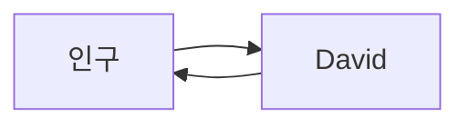
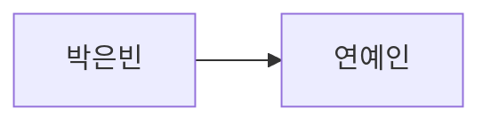

# 네트워크 핵심이론 기초


기초 체력의 목표이기때문에.

사실 지금 이해하면 컴공과 왜 다닙니까.


**네트워크**

Internet 

IP 프로토콜

TCP/IP 


**네트워크를 기본적으로 알아야 하는것들**

1. bit, byte 등 정보 표현의 단위를 안다
2. 1 byte가 8 bit임을 알고있다.
3. bit 단위 논리연산을 할수있다. (논리연산!?)
   1. Mask 연산에 대해서 알고있는가?
4. 2진수를 16진수로 변환할수 있다.
5. 1024MB가 1GB 임을 알고 있다.
6. Process와 Program의 차이를 알고있다.
7. OSI 7 layer 라는 말을 알고있다.
8. 범용 운영체제는 User mode와 Kernel mode가 존재한 다는 것을 알고 있다.
   1. sh 과 kernel 존재를 알고있는가 ? 
9. Buffer의 의미를 알고있다
10. 개념(Abstraction)과 구현(implementation)의 차이를 안다.
11. 나는 '외워서' 라도 네트워크를 잘알고 있다.


## Layer와 Layered 구조 


이해를 돕기 위해서 `도식` 으로 표현하는데.

이 도식을 그리는 이유 바로 `관계` 을 설명 할려고한다.

각 계층(layer) 의 관계를 정의 한다.


Layered 그림의 표현의 의미를 알고있어야한다.

`의존` 적인가 이해해야한다.


## 네트워크와 네트워킹 그리고 개념


### 용어 정리

network 라는 말을 번역 할 수 있을까?

networking 


network 란 `관계` `연결`

> 최소 그럼 두명이 필요합니다. 

networking 은 `상호작용` `처리




인구와 David 와 **상호작용** 을

하고싶어함. 


그런데 문제가 발생함 

의사소통을할 `언어` 가 맞지않음.


### 개념과 구현 




네모 박스가 요소이고,

선이 관계인데


박은빈은 연예인 이라는 관계도 입니다.

연예인은 개념이고

박은빈은 구현(실체)

라고 합니다. 


이런것을 상속 이라고 합니다.


위 그림과 같은 형태를 `UML(Unified Modeling Language)` 이라고합니다. 모델링이다 라고도 합니다.

 


## OSI 7 layer 식별자


OSI 7 Layer

7계층 : HTTP, HTTP (HTTP + SSH)

6계층 :

5계층 : SSL(TLS)

4계층 : TCP, UDP

3계층 : Internet

2계층 : Ethernet

1계층 :


[식별자] : 학번, 주민번호, 이름 등등..

Ethernet -> MAC 주소 

Internet -> IP 주소 (host)

- v4 *
- v6 

TCP, UDP  -> Port 번호 


명령어 외우두자.

```sh
# window 
ipconfig /all

# Mac
ifconfig -a 
```


물리적 주소 === MAC Address

MAC addresss (Media Access Control Address)


NIC (Network interface Card) / 랜카드


LAN -->MAN-->WAN


`packet`  L2 


L2 --> Frame 


### L2 Access switch 


End-point와 직접 연결되는 스위치

MAC주소를 근거로 스위칭 


24 port hub 또는 24 port switch 


LED 색상 

주황 : 충돌났다는 뜻.

녹색 : 잘된다는 뜻


녹색 이뜨면 `link-up` 상태다 

반대는 `link-down` 됬다(연결안됬다.)

 

L2 를에서 Router 에게 연결을 하는행위를 Uplink 라고함


### L2 Distribution switch 

- 쉽게 생각하면 L2 Access 스위치를 위한 스위치
- VLAN(Virtual LAN) 기능을 제공하는 것이 일반적


### LAN 과 WAN의 경계 그리고 Broadcast 


broadcast 주소 ...

직역하면 `방송주소` 

broadcast !== unicast 


**broadcast**

- broadcast 범위를 생각해보자.
- broadcast 주소라는 매우 특별한 주소가 존재한다. (Mac, ip 모두  존재)


### IPv4 주소의 구조

32bit 주소 체계 

8bit * 4개 모여있음.

8bit 의 주목

 

### L3 Packet


Packet -> 단위 데이터


- Packet 이라는 말은 L3 IP Packet 으로 외우기
  - 말할땐 packet으로 말하기 하지만 L3 영역이란것을 인식
- Header 와 Payload로 나누며 이는 상대적인 분류임.
- 최대 크기는 MTU
  - Maxium Transaction Univer..?
  - 1500 byte...  1.4kb 쯤..?


패킷을 실제로 보는 방법은 [wire shark]

[Ethernet Header] [Frame]


### Encapsulation 과 Decapsulation


#### Encapsulation 

-  별것 아니다. 러시아 전통 목각 인형인 마트료시카 인형을 떠올려라.

