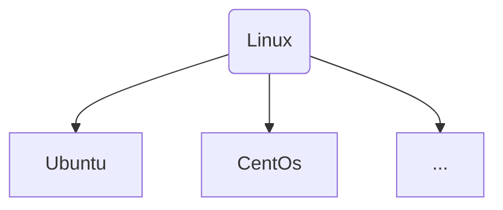
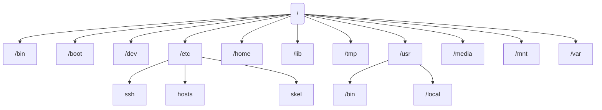

# Linux

## 목차

- 리눅스란
- 리눅스구조
- 리눅스 특징 구조
- Ubuntu for WSL2 
- 디렉토리 구조
- CLI (Command Line Interface)
- 사용자 계정 

## 리눅스란

리누즈 토발즈(Linus Torvalds)에 의해 만들어진 컴퓨터 운영체제로, 자유 소프트웨어와 오픈 소스 개발의 가장 유명한 표본입니다. 컴퓨터 역사상 가장 많은 참여자가 관여하고 있는 오픈소스로 누구나 개발에 참여하고 코드를 볼 수 있는 프로젝트입니다.

아, 참고로 이 펭귄은 리눅스의 마스코트로 이름은 턱스(Tux)입니다. 

또한, 리눅스는 GNU 프로젝트의 일환입니다. GNU 프로젝트란, **"GNU(그누) is not Unix(원래 문장 안에 자신이 이미 들어있는 재귀 약자)"**의 줄임말로, 리처드 스톨먼의 주도하에 시작된 공개 소프트웨어 프로젝트입니다.
유닉스 운영체제를 각자의 회사에서 개발하고 소스 코드를 공유하지 않는 문화에 대한 반발로 생겼습니다. 자유 소프트웨어라는 철학을 가지고 있으며, 스톨만은 첫 선언문에 이은 GNU 선언문을 비롯한 여러 글들을 통해서 **"초기 전산 공동체에 지배적이었던 협동 정신을 되돌리자"**고 주장했습니다.

## 리눅스구조

*카카오톡*,*Excel* 혹 *Chrome* 같은 웹브라우저 처럼 컴퓨터에 실행 프로그램을 `응용 프로그램`  이라고합니다.

이러한 응용프로그램에서 사용자(컴퓨터를 사용하는 사람)이 명령을 내리면 `Shell` 은 이 명령을 해석합시다.

>  Shell은 명령어 해석기 라고도 부릅니다.

해석된 사용자 입력 명령어를 **Kernel(커널)**  에게 전달

**Kernel** 은 **하드웨어** 를 제어하는 코드를 통해 소프트웨어와 커뮤니케이션을 하며,

시스템 모든 자원을 통제/관리하는 역활을 수행합니다.

## 리눅스 특징 구조

리눅스는 유닉스(Unix) 라는 운영체제 기반으로 하고 있으며, 

뛰어난 안정성과 보안성, 높은 신뢰성과 성능이 특징

시스템 자원을 효율적으로 관리 및 사용할수 있으며, 멀티 유저 (Multi-user) 와 멀티 태스킹(multi-tasking) 을 지원

- 멀티 유저 (Multi-user) : 여러 사용자가 동시에 하나의 시스템에 접근
- 멀티 태스킹 (Multi-Tasking) : 여러 개의 작업을 동시에 실행하고, 교대로 컴퓨터의 자원을 사용 하는 기능

또한, 대부분의 리눅스는 CLI(명령어창)와 GUI(그래픽)를 모두 지원하고 있으며, 

다양하고 강력한 네트워킹 기능 덕분에 서버 OS로 적합합니다. 

PC 서버에서도 엔터프라이즈 급의 성능을 제공하고, 성능이 낮은 PC에서도 작동합니다. 

앞서 언급한 것과 같이 오픈소스 프로젝트이기 때문에 커널 소스코드 및 모든 관련 자료가 공개되어 빠른 발전을 지원하고 있습니다. 

다양한 업무 환경을 만족시키는 다양한 배포판이 존재하고 풍부한 응용프로그램을 제공하고 있습니다.

## 우분투 (Ubuntu)

우분투 라는것은 `Linux` 라는 OS 중에서 `제품명` 이라고 보시면 이해하기 쉽습니다.

Linux 계열의 여러가지 Linux 상품들이 많은데.

너무많아서 일일이 말하는것도 어렵기때문에

한번 알아보는것도 좋겠죠?

> 개인적으로 저는 처음 시작한 애는 CentOS 이였습니다.

## 디렉토리 구조

- 리눅스의 파일 시스템 구조
  - 리눅스 시스템의 디렉토리 구조는 전체적으로 역 트리 (tree) 구조를 하고 있다. 그리고 명령어의 종류와 성격, 사용권한등에 따라 각각의 디렉토리들로 구분된다.
  - 리눅스 배포 판들은 '리눅스 파일스시템 표준' 인 **FSSTND (Linux File System Standard)** 라는 표준을 준수하므로 대부분 리눅스 배포 판들은 위에 같은 기본 골격이 같다.

### 1.1 `/` (루트)

최상위 디렉토리 `루트`  의미하며, 리눅스의 모든 디렉토리들의 시작점이다. 

만약 절대경로 (처음부터 끝까지) 입력할려고 할시 `/` 부터 시작해야한다.

> ex) /home
>
> 이건 루트 디렉토리에서 home 디렉토리를 가르키는말.

### 1.2 /bin

기본적인 명령어가 저장된 디렉토리. 즉, 리눅스 시스템사용에 있어 가장 기본적이라 할 수 있는 mv, cp, rm 등과 같은 명령어들이 

이 디렉토리에 존재하며 `root` 사용자와 일반사용자가 함께 사ㅛㅇ할 수 있는 명령어 디렉토리 이다.

> ex ) cat, chmod, chown, cp, date, echo, kill, ln, ls, mkdir, more, mount, mv, ps, pwd, rm, sh, su, vi 등등등...

### 1.3 /boot

리눅스 부트로더(boot loader) 가 존재하는 디렉토리. 즉, GRUB과 같은 부트로더에 관한 파일들 (grub.conf 등)이 

`/boot` 안에 존재한다.

> 참고자료 : https://jjeongil.tistory.com/611 

###  1.4 /dev

각종 디바이스 파일들이 위치해 있는데 크게 블록 디바이스와 캐릭터 디바이스로 나뉠 수 있다. **블록 디바이스**란 HDD와 같은 주변 장치를 말하는데,

데이타가 블록 단위로 읽고 쓰여지며 랜덤하게 액세스할 수 있다. 반면 **캐릭터 디바이스**는 입출력이 한 바이트 단위로 이루어지며 데이터가 순차적으로 읽고 쓰여진다. 

디바이스를 새로 만들 때에는 **mknod** 명령을 이용하면 되며, 물론 /bin 에 위치해 있다. mount를 할 때에 필요한 디바이스 몇 개만 소개한다.

**/dev/fd0** 플로피 디스크 디바이스

첫 번째 FDD의 디바이스로 두 번째의 경우는 0 대신 1을, 세 번째의 경우는 2를 써주면 된다.

**/dev/hda or /dev/hda1** IDE 하드 디스크 디바이스

마지막 부분의 hda에서 'a'는 위치를 나타내는 것으로, 'a'는 primary master, 'b'는 primary slave, 'c'는 secondary master, 'd'는 secondary slave를 의미한다. 그리고 그 뒤에 숫자가 없을 경우에는 전체를 의미한다. 숫자를 달 경우에는 파티션을 의미한다.

**/dev/sda, /dev/sda1** SCSI 하드 디스크 디바이스

IDE 하드 디스크 디바이스와 같으나 'h' 대신 's'를 쓴다.

**/dev/cdrom** 하드웨어 관련 디바이스

CD-ROM 디바이스이다.

### 1.5 /etc

시스템의 거의 모든 설정파일이 존재하는 디렉토리, `/etc/sysconfig(시스템 제어판용 설정파일)`, `/etc/password(사용자관리 설정파일)`

`/etc/named.conf(DNS 설정파일)`  등과 같은 파일들이 존재한다.

**/etc/ssh** : SSH 서비스, 즉 sshd 데몬에서 사용하는 각종 설정파일들이 존재하는 디렉토리.

**/etc/hosts** : 도메인의 IP를 찾을 때 컴퓨터가 맨 처음 조사하는 파일이다(그러니깐 DNS 파일인 것이다).

> 윈도우는 C:\Windows\System32\Drivers\etc\hosts

**/etc/skel**: 계정 사용자 생성시의 초기화 파일들이 저장된 디렉토리(useradd) 에서 사용함

### 1.6 /home

사용자의 홈 디렉토리, useradd 명령어로 새로운 사용자를 생성하면 대부분 사용자의 `id` 와 동일한 이름의 디렉토리가 자동으로 생성됨

> 만약 계정이 ingoo 라면 /home 디렉토리안에 `ingoo` 라는 디렉토리가 생김. 그리고
>
> 본인계정명의 디렉토리를 들어갈려면 cd /home/ingoo 를 쳐야하지만 대부분 많이 쓰는경우가 많아서 별칭이 존재함
>
> `~` 이 홈디렉토리를 뜻함. 즉 
>
> cd ~ 과 cd /home/ingoo 와 같다는뜻.

### 1.7 /lib

커널모듈파일과 라이브러리파일 즉, 커널이 필요로 하는 커널모듈파일들과 프로그램 (C,C++ 등) 에 필요한 각종 라이브러리 파일들이 존재하는 디렉토리.

### 1.8 /media

DVD, CD-ROM, USB 등과 같은 탈 부착이 가능한 장치들의 마운트포인트로 사용되는 디렉토리

### 1.9 /mnt 

/media 디렉토리와 비슷한 용도로 탈 부착이 가능한 장치들에 대하여 일시적인 마운트포인트로  사용하는 디렉토리

> 라고 하면 어렵지만 WSL2를 사용하는 우리로써는, 그냥 `windows` 에 디렉토리가 담겨져있습니다.

### 1.10 /var

어플리케이션 운용중에 생성되었다가 삭제되는 데이터를 일시적으로 저장하기 위한 디렉토리, 거의 모든 시스템로그파일은

`/var/log/` 에 저장되고, DNS의 zone 설정 파일은 `/var/named`에 저장됩니다. 

## CLI 

> 참고자료 : https://velog.io/@james3299/Linux-%EB%AA%85%EB%A0%B9%EC%96%B4-%EC%A0%95%EB%A6%AC

이전  PDF 참고

### vim

vim에 대해 배우기 

파일열기

- 기본모드
  - 명령모드
  - 입력모드

​	

입력모드 들어가는 방법 `i`

종료옵션

`:q` :  그냥 종료

`:q!` : 강제종료

`:w` : 저장

`:w!`  :강제저장

`:wq`  : 저장하고 종료

`:wq!`: 강제 저장하고 종료

