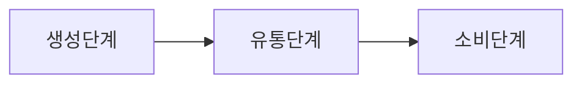

# 미션 가이드

## 1. 프로그램 소개

이더리움 기반의 NFT 음악 디지털 앨범 펀딩 플랫폼 

음원 유통 구조는 

이루어져 있습니다.

생성 단계 투자를 받을 수 있는 Application 입니다.

이후 

구독권이 있는 사용자는 스트리밍 서비스를 들 을 수 있습니다.

## 2. 래퍼런스

*음원*

- https://www.artstock.com/art/intro  : 온라인 미술품 지분 거래 플랫폼 
- Millim:X 

https://m.blog.naver.com/ssoundgear/221548768965

https://m.blog.naver.com/skstudio/221917179390

*거버넌스* 

- https://contents.premium.naver.com/elliotwave/elliottperson/contents/220912222210375ne

- http://journal.dcs.or.kr/xml/31798/31798.pdf

- https://docs.soliditylang.org/en/v0.8.17/solidity-by-example.html

*ICO*

- https://smlee729.wordpress.com/2018/04/08/%EC%9D%B4%EB%8D%94%EB%A6%AC%EC%9B%80-%EA%B8%B0%EB%B0%98-%EC%8A%A4%EB%A7%88%ED%8A%B8-%EA%B3%84%EC%95%BD-%EA%B0%9C%EB%B0%9C%ED%95%98%EA%B8%B0-%ED%86%A0%ED%81%B0-%ED%81%AC%EB%9D%BC%EC%9A%B0/

*구매*

- https://docs.soliditylang.org/en/v0.8.17/solidity-by-example.html#id2

*TDD*

- https://cjwoov.tistory.com/9

## 3. 필요로 하는 기능 

### 3. 1 회원 

- 회원 가입 : 지갑을 이용하여 회원 가입을 진행합니다. 추가로 닉네임, 이메일 과 크리에이터 를 등록합니다.
  - 회원은 크게 일반유저 와 크리에이터 가 존재합니다. 
  - 회원은 NFT을 보유량에 따라 수익을 정산 받습니다. 
  - 음원 스트리밍을 진행 할 시 

### 3. 2 음원 생성 등록

- 음원 제작 펀딩 등록 

  - [필수] 카테고리

  - [필수] 작곡가

    - 작곡가 프로필 URL 

  - [필수] 작사

    - 작사 프로필 URL

  - [필수] 가수

    - 가수 프로필 URL

  - [필수] 음원 분위기

  - [필수] 음원 내용

  - [필수] 판매 수량

  - [필수] 판매 단가

  - [필수] 판매 기간

  - [선택] 앨범 프로토 타입 

  - [선택] 커버 사진 

    

-  판매 기간 동안 총 판매 금액 (판매 단가 * 판매 수량) 충족하지 못하면, 환불 처리가 됩니다.

  

### 3.3 거버넌스

- 음원 제작에서 투표를 통해 방향을 제안합니다.
  - ex) 기간을 한달 늘리자 or 멜론에 올리자 등, 작사, 작곡가, 가수 변경 요청.
  - NFT 보유량에 에 따라 가결 및 체결 처리, 이후 제작 방향성 결정.

​	

### 3.4 구매

#### 판매 기간 내 구매

- 음원 생성 등록 이후, 일반 사용자는 자유롭게, 이더리움 으로 생성 단계 에서 투자를 진행 할 수 있습니다.
- 판매 기간 동안 자유롭게 판매 단가로 구매가 진행됩니다. 
- 구매가 진행이 되면, email 로 구매 완료 이메일이 전송됩니다. 해당 CA 계정 등 음원 제작 내용을 담아 보냅니다.

#### 판매 기간 이후 구매

- 판매 기간이 이후에 상품은 호가창과, 그래프를 통해 NFT 수량을 사고 팔수 있습니다.

  

### 3.5 판매

- 판매 기간 지난 이후 사용자는 NFT 수량을 원하는 금액에 판매 등록 을 할 수 있습니다.

### 3.6 스트리밍

- 일반 사용자는 구독권 구매를 하면, 재생버튼이 활성화 합니다.
- 회원은 음원을 재생목록 을 담을 수 있습니다.

### 3.7 정산 

- 구독권 에 따른 음원 재생횟수에 따라, 수익이 분산됩니다.

- NFT 보유량에 따라 음원이 실제 수익 창출이 되면 이더리움 으로 보상을 받습니다. 

### 3.8 마이페이지

- 사용자는 본인의 소유한 NFT 와 수량을 볼 수 있습니다.
- 사용자 정보를 볼 수 있습니다..
- 즐겨 찾기 목록을 볼 수 있습니다.
- 본인이 판매 등록한 내용을 볼 수 있습니다.

## 4. 활용 기술

>  굵은 글씨는 필수 사항 입니다.
>
> 

- **Solidity** -  Smart Contract 배포를 위해 활용.

- **Goerli (test net)** - 이더리움 테스트넷 
- **MetaMask** - 지갑 활용 
- **ERC1155** - NFT 수량 
- **web3js** 
- **Truffle** 
- **nodejs**
- **Swagger** - API 문서를 위해 꼭 작성 해주세요. 
- **Jest** - 단위 테스트, 통합 테스트 를 꼭 진행 해주세요.
- Typescript
- nextjs - SSR 을 위한 nextJS 
  - 어려우시면 React로 하셔도 됩니다.
  - 전역 상태관리 는 어떤 걸 로 하셔도 괜찮습니다.
- nestjs  
- AWS 
- redis
- AWS EC2
- AWS S3
- mysql - postgresql 사용도 가능.
- Optimism
- styled-component

## 5. 개발 환경

- 빌드환경 
  - visual studio code 등
- 이슈 관리
  - jira, Trello, Redmine 등
- 문서관리
  - Google Docs,  Notion 등
- 형상관리 
  - git, github

## 6. 결과물

모든 내용은 배포가 진행 되어야 합니다. (host 입력 시 나옴.)

PC, Mobile 등 반응형 웹으로 구현 되어야 합니다.

모든 router는 API 문서가 제작되어야 합니다.

이슈 트래킹 이 되어야 합니다. 

> 프로젝트 결과물 중, 구현되지 않는 내용은 이슈 관리에 남겨져 있어야 합니다.

일일 보고서, 및 일정 내용을 문서에 기록합니다.